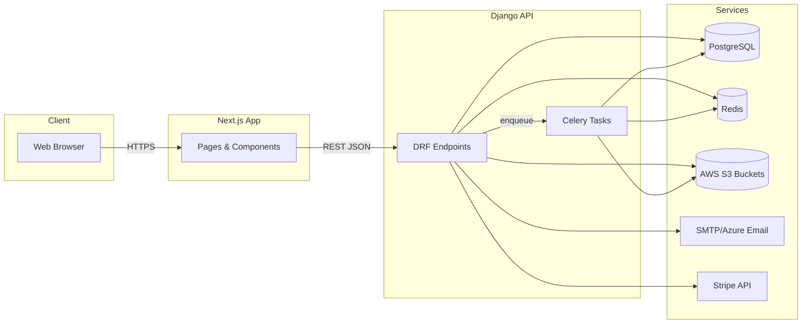
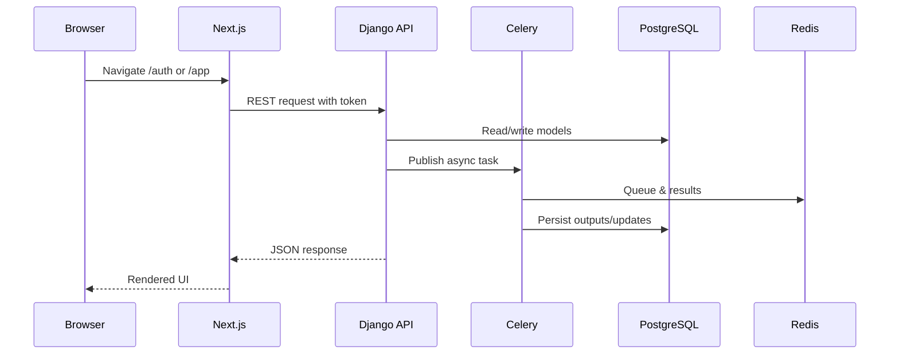

## Architecture Overview

This project is a monorepo with a Django REST backend and a Next.js frontend.

- Backend (Django 4.1.x) lives under `src/api/`
- Frontend (Next.js 13) lives under `src/ui/`
- Celery workers and scheduled jobs are configured via `src/api/startdate/celery.py`
- PostgreSQL is the primary DB; Redis is used for Celery broker/result and caching

### System Context



### Backend Components

Key Django apps (from `INSTALLED_APPS`):

- `accounts`, `candidate`, `company`, `job_posting`, `conversation_thread` – core entities
- `machine_learning`, `model_training` – ranking, ML job orchestration
- `payment_history` – subscriptions/billing (Stripe)
- `adwerks`, `integrations`, `powered_by`, `playground` – aux integrations and flows
- `celery_jobs` – background/import tasks and schedulers
- `filters`, `location`, `title_mapping`, `genai_profile`, `shareable_link` – utilities/verticals

### Request Flow (Backend)



### Routing Map (Top-level)

The root router composes all app-level routers.

```19:36:src/api/startdate/urls.py
urlpatterns = [
    path('admin/', admin.site.urls),
    path('api/users/', include('accounts.urls')),
    path('api/accounts/', include('accounts.urls')),
    path('api/candidates/', include('candidate.urls')),
    path('api/jobs/', include('job_posting.urls')),
    path('api/companies/', include('company.urls')),
    path('api/machine_learning/', include('machine_learning.urls')),
    path('api/adwerks/', include('adwerks.urls')),
    path('api/subscriptions/', include('payment_history.urls')),
    path('api/locations/', include('location.urls')),
    path('api/v1/powered_by/', include('powered_by.urls')),
    path('api/v1/playground/', include('playground.urls')),
    path('api/model_training/', include('model_training.urls')),
    path('api/shareable/candidates/', include('shareable_link.urls')),
    path('api/chats/', include('conversation_thread.urls')),
    path('api/job_titles/', include('title_mapping.urls')),
]
```

### Configuration

Key configurations are centralized in `src/api/startdate/settings.py`.

```101:146:src/api/startdate/settings.py
INSTALLED_APPS = [
    'django.contrib.admin',
    'django.contrib.auth',
    'django.contrib.contenttypes',
    'django.contrib.sessions',
    'django.contrib.messages',
    'django.contrib.staticfiles',
    'django_celery_beat',
    'corsheaders',
    'softdelete',
    'knox',
    'accounts',
    'candidate',
    'company',
    'job_posting',
    'celery_jobs',
    'payment_history',
    'machine_learning',
    'adwerks',
    'location',
    'integrations',
    'genai_profile',
    'powered_by',
    'playground',
    'model_training',
    'shareable_link',
    'conversation_thread',
    'filters',
    'title_mapping'
]
```


