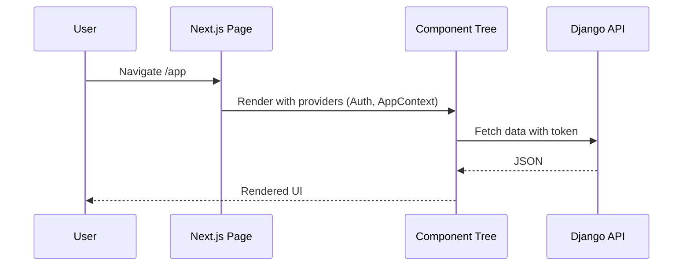

## Frontend (Next.js) Overview

- Next.js 13 app located at `src/ui/`
- Built with Tailwind, MUI, HeadlessUI, Chart.js, and various utility libs
- PM2 configs for multi-env start via `ecosystem.config.js`

### Configuration

```1:24:src/ui/next.config.js
const nextConfig = {
  reactStrictMode: true,
  images: {
    unoptimized: true,
  },
}
module.exports = nextConfig
```

```1:16:src/ui/package.json
{
  "scripts": {
    "dev": "next dev",
    "build": "next build && next export -o webDist/",
    "export": "next export",
    "start": "next start",
    "deploy:local": "next build && pm2 start ecosystem.config.js --env local",
    "deploy:staging": "next build && pm2 start ecosystem.config.js --env staging",
    "deploy:prod": "next build && pm2 start ecosystem.config.js --env production"
  },
  ...
}
```

### Application Shell

Global providers and theming are wired in `_app.tsx`.

```1:20:src/ui/pages/_app.tsx
import { AuthContextProvider } from "@/src/component/context/authProvider";
import AppContext from "@/src/context/Context";
import "@/styles/globals.css";
...
export default function App({ Component, pageProps }: AppProps) {
```

### Routing

- Uses Next.js pages router under `src/ui/pages/`
- A central route map (`src/ui/src/routes.tsx`) is used by UI components/menus

### UI Architecture

- `src/ui/src/component/` – shared components (cards, layouts, dialogs)
- `src/ui/src/context/` – React contexts (auth/app-level state)
- `src/ui/src/utils/` – utility helpers (theme, customization)

### Rendering Flow




